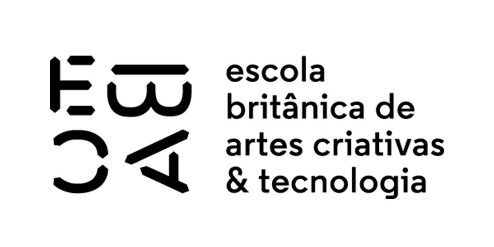

<h1 align="center">
  Repositório de Exercícios | EBAC
</h1>

## 💻 Projeto

<h3>Alguns dos exercícios realizados durante a parte de Front-End no curso da EBAC - Escola Britânica de Artes Criativas e Tecnologia, separados por branches.</h3>

## 🚀 Tecnologias

- HTML
- CSS
- JavaScript
- jQuery
- Bootstrap
